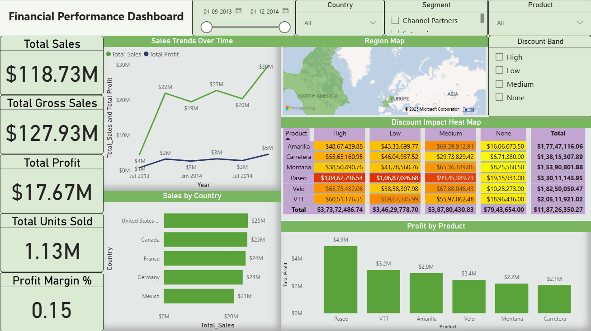

# Financial Sales Performance Dashboard

## Project Overview

This project is an interactive Financial Sales Performance Dashboard developed using Power BI to analyze business sales data and generate financial insights.

The dashboard helps monitor:
- Sales performance
- Profit analysis
- Discount impact
- Country-wise sales
- Product profitability
- Business KPIs

---

# Tools & Technologies Used

- Power BI
- DAX
- Power Query
- Data Visualization
- Financial Analytics

---

# Dashboard Features

## Financial KPIs
- Total Sales
- Total Gross Sales
- Total Profit
- Total Units Sold
- Profit Margin %

## Sales Analysis
- Sales Trends Over Time
- Country-wise Sales Analysis
- Product-wise Profit Analysis

## Business Performance Insights
- Discount Impact Heat Map
- Regional Sales Mapping
- Segment & Product Filtering
- Interactive Dashboard Slicers

---

# Dashboard Screenshot

---

# Key Business Insights

- Sales and profit trends show consistent business growth over time.
- Certain products contribute significantly higher profits than others.
- Discount levels have a major impact on overall profitability.
- Country-wise sales analysis highlights top-performing markets.
- KPI monitoring helps evaluate overall financial performance effectively.

---

# Project Workflow

1. Data Collection
2. Data Cleaning & Transformation
3. Data Modeling
4. DAX Calculations
5. Dashboard Development
6. Financial Insight Generation

---

# Files Included

- `.pbix` dashboard file
- Dashboard screenshot
- Project documentation

---

# How to Use

1. Download the `.pbix` file
2. Open using Power BI Desktop
3. Explore dashboard filters and visualizations

---

# Author

Aryan Sharan
